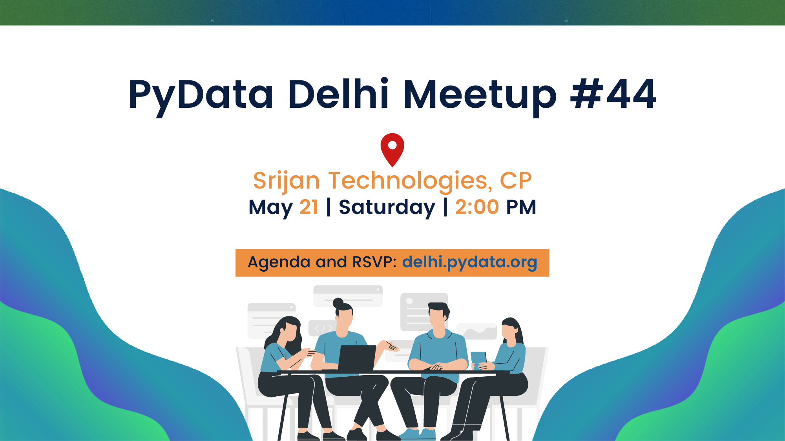

## Agenda:

Schedule (2:00 PM - 6:00 PM):

1. [Lightning Talk ⚡️] What's, Why's and How's of Zarr by Sanket Verma

2. Scaling Data Science with Dask by Pavithra Eswaramoorthy
[https://github.com/pydatadelhi/talks/issues/133](https://github.com/pydatadelhi/talks/issues/133)

3. Break and Networking

4. [Invited Talk by Srijan 🔥] Adopting clean architecture in your new project by
Bibek Joshi

5. [Lightning Talk ⚡️] Exploring Starry Realms in the Milky Way with Gaia by
Chetan Chawla [https://github.com/pydatadelhi/talks/issues/134](https://github.com/pydatadelhi/talks/issues/134)

6. Closing Notes and Goodies!

People who would like to volunteer to PyData Delhi, please stay for a while
after the meetups end!

Note: Please keep your RSVP up to date, it is a very nice thing to do! Most
likely, we won't be able to entertain more than the max RSVP limit!

Logistics:

• Venue map: [https://goo.gl/maps/wgTwHrkri5n3zSRs9](https://goo.gl/maps/wgTwHrkri5n3zSRs9)

• Nearest Metro Station: Janpath (Violet Line)

Doors open at 1:30 PM, and talks start at 2:00 PM.

***

Please, unRSVP if you realise you can't make it. We're limited by space on the
number of attendees, so please free up your place for your fellow community
members!

Follow [@pydatadelhi](http://twitter.com/pydatadelhi) for updates and early
announcements. See you at the meetup!

We're on Telegram. Join us for early updates and discussions [here](https://t.me/+QatRDofNFylXHrpH).

Share your Lightning Talks! A "lightning talk" is a quick mini-presentation
(5 minutes maximum) on any Python, Julia, R, tips & tricks, caveats or personal
project you'd like. We'll save time for 2-3 of these each month: to save a
spot, post a comment with your talk's title/topic and create an issue at
[https://github.com/pydatadelhi/talks/issues](https://github.com/pydatadelhi/talks/issues). 
Beginner topics are always welcome!

See you at the meetup! ✌🏻
